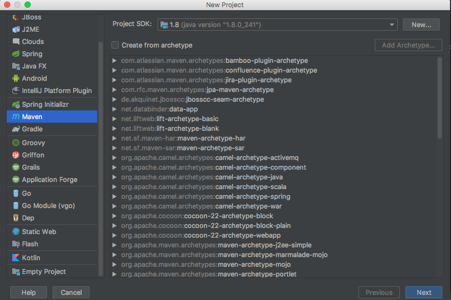
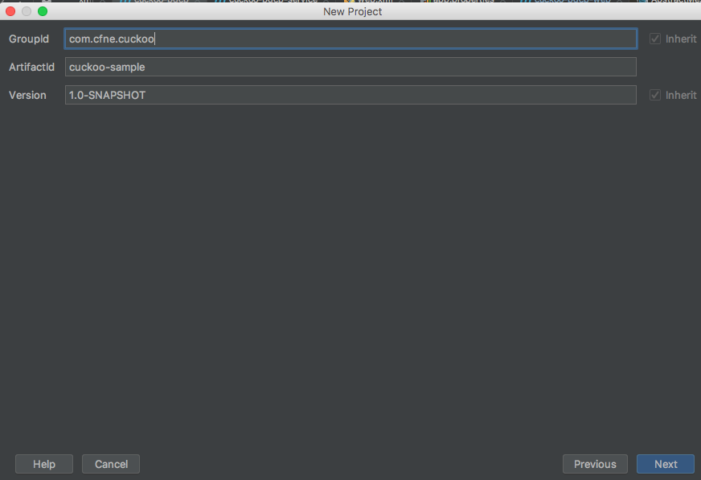
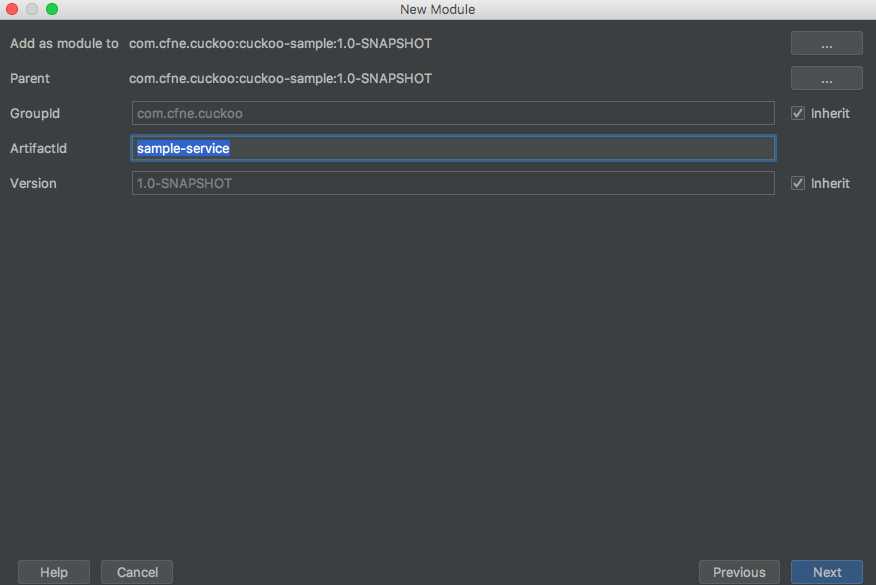
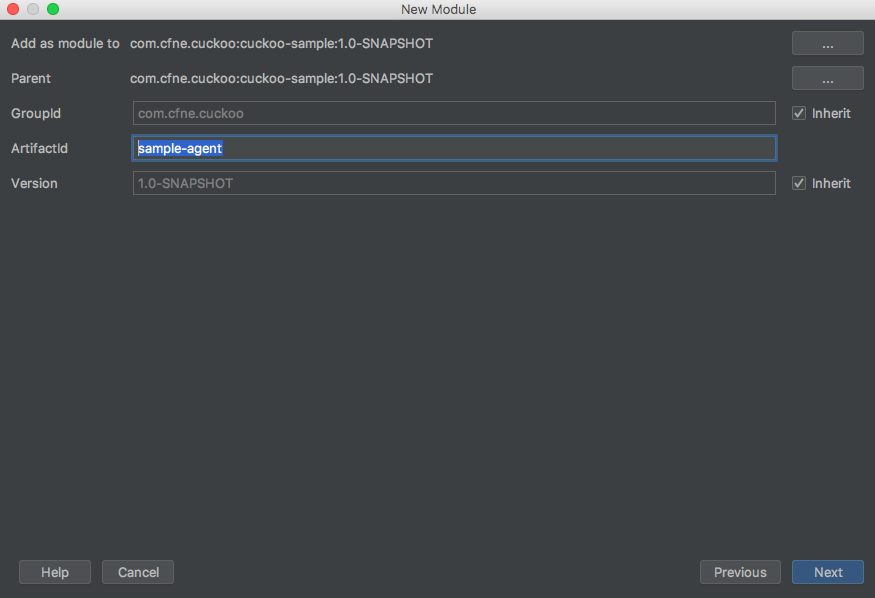
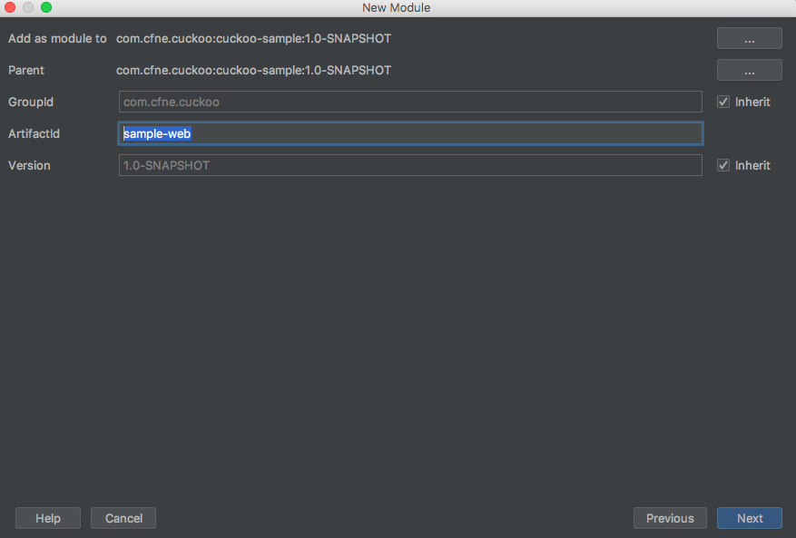
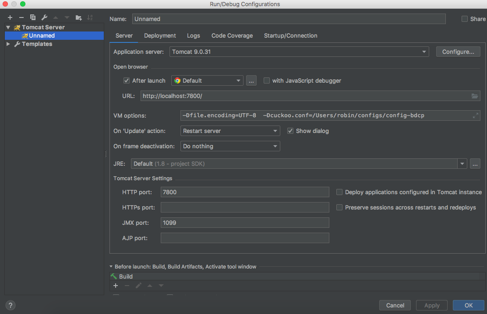
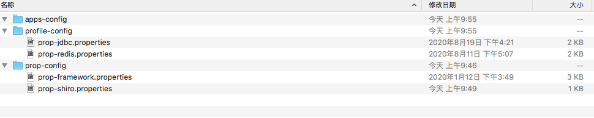

### cuckoo2.x入门

这篇文章主要是讲简单集成cuckoo2.x框架

## 创建工程

创建项目





再创建一个模块，sample-service



再创建sample-agent



最后创建sample-web 



先修改父pom.xml的依赖

```xml
<parent>
    <groupId>com.cfne.cuckoo</groupId>
    <artifactId>cuckoo-parent</artifactId>
    <version>2.0.7-RELEASE</version>
</parent>

<modelVersion>4.0.0</modelVersion>
<groupId>com.cfne.cuckoo</groupId>
<artifactId>cuckoo-sample</artifactId>
<packaging>pom</packaging>
<version>1.0-SNAPSHOT</version>
<modules>
    <module>sample-service</module>
    <module>sample-agent</module>
    <module>sample-web</module>
</modules>
<properties>
    <cuckoo.framework.version>2.0.7-RELEASE</cuckoo.framework.version>
</properties>

```

其次是修改sample-web的pom.xml依赖

```xml
<parent>
    <artifactId>cuckoo-sample</artifactId>
    <groupId>com.cfne.cuckoo</groupId>
    <version>1.0-SNAPSHOT</version>
</parent>
<modelVersion>4.0.0</modelVersion>
<artifactId>sample-web</artifactId>
<packaging>war</packaging>

<dependencies>
    <dependency>
        <groupId>com.cfne.cuckoo</groupId>
        <artifactId>sample-agent</artifactId>
        <version>1.0-SNAPSHOT</version>
    </dependency>

    <dependency>
        <groupId>com.cfne.cuckoo</groupId>
        <artifactId>cuckoo-web</artifactId>
        <version>${cuckoo.framework.version}</version>
        <type>war</type>
    </dependency>
</dependencies>


<build>
    <finalName>sample-web</finalName>
    <resources>
        <resource>
            <targetPath>${project.build.directory}/classes</targetPath>
            <directory>src/main/resources</directory>
        </resource>
    </resources>
    <plugins>
        <plugin>
            <groupId>org.apache.maven.plugins</groupId>
            <artifactId>maven-war-plugin</artifactId>
            <executions>
                <execution>
                    <phase>install</phase>
                </execution>
            </executions>
            <configuration>
                <failOnMissingWebXml>false</failOnMissingWebXml>
                <!-- http://maven.apache.org/plugins/maven-war-plugin/index.html -->
                <overlays>
                    <overlay>
                        <groupId>com.cfne.cuckoo</groupId>
                        <artifactId>cuckoo-web</artifactId>
                    </overlay>
                </overlays>
            </configuration>
        </plugin>
    </plugins>
</build>
```

修改samle-agent的pom.xml

```xml
    <parent>
        <artifactId>cuckoo-sample</artifactId>
        <groupId>com.cfne.cuckoo</groupId>
        <version>1.0-SNAPSHOT</version>
    </parent>
    <modelVersion>4.0.0</modelVersion>

    <artifactId>sample-agent</artifactId>

    <dependencies>
        <dependency>
            <groupId>com.cfne.cuckoo</groupId>
            <artifactId>cuckoo-framework</artifactId>
            <version>${cuckoo.framework.version}</version>
        </dependency>
    </dependencies>
</project>
```

写一个简单的controller类

```java
@Controller
public class SampleController extends BaseController {

    @ResponseBody
    @RequestMapping("/sample")
    public String sample(){
        return "sample";
    }
}
```


将sample-web布署到tomcat中，指定配置文件路径



运行tomcat 


输入用户名密码登录后,访问http://10.65.20.240:7800/sample 


好了，一个简单的web应用就搭建完成了

## 配置文件

prop-jdbc.properties

```properties
druid.database.dialectType=mysql
#master
druid.master.url=jdbc:mysql://127.0.0.1:3306/bdcp?useUnicode=true&characterEncoding=utf-8
druid.master.driverClassName=com.mysql.jdbc.Driver
druid.master.username=root
druid.master.password=root

druid.master.filters=stat
druid.master.maxActive=200
druid.master.initialSize=1
druid.master.maxWait=60000
druid.master.minIdle=10
druid.master.maxIdle=15
druid.master.timeBetweenEvictionRunsMillis=60000
druid.master.minEvictableIdleTimeMillis=300000
druid.master.validationQuery=SELECT 'x' FROM DUAL
druid.master.testWhileIdle=true
druid.master.testOnBorrow=false
druid.master.testOnReturn=false
druid.master.maxOpenPreparedStatements=20
druid.master.removeAbandoned=true
druid.master.removeAbandonedTimeout=180
druid.master.logAbandoned=true

#slave
druid.slave.url=jdbc:mysql://127.0.0.1:3306/bdcp?useUnicode=true&characterEncoding=utf-8
druid.slave.driverClassName=com.mysql.jdbc.Driver
druid.slave.username=root
druid.slave.password=root

druid.slave.filters=stat,cat
druid.slave.maxActive=200
druid.slave.initialSize=10
druid.slave.maxWait=60000
druid.slave.minIdle=30
druid.slave.maxIdle=50
druid.slave.timeBetweenEvictionRunsMillis=60000
druid.slave.minEvictableIdleTimeMillis=300000
druid.slave.validationQuery=SELECT 'x' FROM DUAL
druid.slave.testWhileIdle=true
druid.slave.testOnBorrow=false
druid.slave.testOnReturn=false
druid.slave.maxOpenPreparedStatements=20
druid.slave.removeAbandoned=true
druid.slave.removeAbandonedTimeout=180
druid.slave.logAbandoned=true
```

prop-redis.properties

```properties
redis.host1=127.0.0.1
redis.port1=7001
redis.host2=127.0.0.1
redis.port2=7002
redis.host3=127.0.0.1
redis.port3=7003
redis.host4=127.0.0.1
redis.port4=7004
redis.host5=127.0.0.1
redis.port5=7005
redis.host6=127.0.0.1
redis.port6=7006

#密码
redis.pass=
#客户端超时时间单位是毫秒
redis.timeout=100000
#最大连接数
redis.maxTotal=1000
#最大空闲数
redis.maxIdle=100
#最小空闲数
redis.minIdle=10
#最大建立连接等待时间
redis.maxWaitMillis=1000
#指明是否在从池中取出连接前进行检验,如果检验失败,则从池中去除连接并尝试取出另一个
redis.testOnBorrow=true
#默认的实效的时间(单位是秒)
redis.expiration=7200
#是否使用redis
jedis.cacheEnable=true
#是否允许初始化缓存数据
jedis.initDataServer=true
# redis命名空间(基础数据缓存的命名空间)
redis.namespace=spring:redis:taskboot
# redis命名空间(用户会话的命名空间)
# spring会话共享的namespace=spring:session:cukcoo
redis.spring.session.namespace=taskboot
# redis存储会话缓存的时间
redis.spring.session.maxInactiveIntervalInSeconds=1800
# Spring-session&redis子域名共享session
redis.spring.session.domainName=127.0.0.1
#用户权限的存储到redis的命名空间
redis.shiro.authorization.namespace=spring:shiro:mytaskboot
```

prop-framework.properties

```properties
# 系统属性配置文件framework
# 系统定时任务调度器的POOLSize
cuckoo.framework.task.scheduler.poolsize=20
# 系统默认日志缓存最大值
cuckoo.framework.logs.max.buffer.size=30
# Service的监控日志是否允许控制台输出
cuckoo.framework.logs.console.enabled=false
# 定时刷新到数据库的表达式
cuckoo.framework.logs.flush.cron=0 0/30 * * * ?
#系统无缓存随机版本号
system.static.assets.nocache.random=V1.1.4
#默认系统编码
cuckoo.framework.sys.app.code=cf_sys
#数据签名key
cuckoo.signing.key=981d9186401245f998f339220144e8b4
```

prop-shiro.properties

```properties
#Desc Shiro模块配置文件 pac4j模式
#服务地址
cuckoo.web.shiro.cas.service=http://10.65.20.240:7800/
#shiro登录地址
cuckoo.web.shiro.cas.loginUrl=http://castest.zto56.com/login
#Cas服务地址
cuckoo.web.shiro.cas.serverUrlPrefix=http://castest.zto56.com/
#Cas服务
cuckoo.web.shiro.cas.callbackUrl=http://10.65.20.240:7800/callback?client_name=casClient
#登录失败地址
cuckoo.web.shiro.cas.failureUrl=http://castest.zto56.com/login?service=http://10.65.20.240:7800/
#登录成功地址
cuckoo.web.shiro.cas.successUrl=http://10.65.20.240:7800/module/index?mv=index
#不需要鉴权的视图列表
cuckoo.web.shiro.anon.views=index,home,rs/MyResources,main,comm/download,sys/updatapass,bdcp/updatapass,kaptcha/kaptchaDeliver,kaptcha/kaptchaWin,sys/operationLogger

#校验客户端IP所在地发生变化配置开关
cuckoo.web.shiro.clienthost.changecheck=true
cuckoo.web.authorized.request.api.url=
#校验客户端IP所在地发生变化白名单
cuckoo.web.shiro.clienthost.whitelist=
swagger.enable=false
```

配置文件结构如下，请正确配置好，各个文件存放的目录



