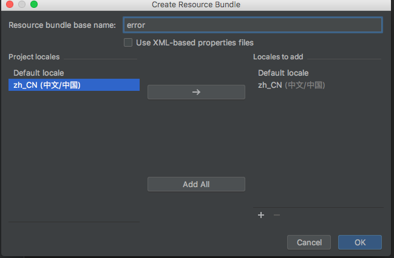
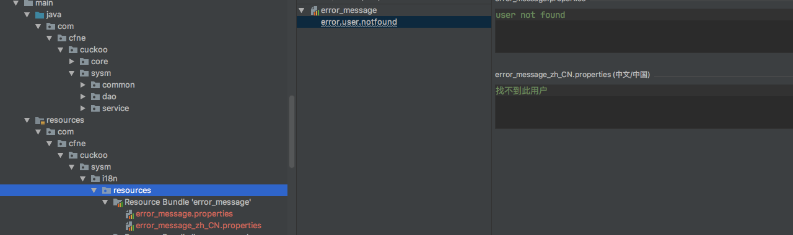

# cuckoo-framework

cuckoo-framework模块整个框架的核心，主要功能如下:

## 动态数据源

动态数据源，默认采用的名为“slaveDataSource”的数据源,配置如下

```properties
druid.database.dialectType=mysql
#master
druid.master.url=jdbc:mysql://10.15.10.228:3306/cuckoo?useUnicode=true&characterEncoding=utf-8
druid.master.driverClassName=com.mysql.jdbc.Driver
druid.master.username=cuckoo
druid.master.password=Cuckoo#%09
druid.master.filters=stat,wall
druid.master.maxActive=200
druid.master.initialSize=1
druid.master.maxWait=60000
druid.master.minIdle=10
druid.master.maxIdle=15
druid.master.timeBetweenEvictionRunsMillis=60000
druid.master.minEvictableIdleTimeMillis=300000
druid.master.validationQuery=SELECT 'x' FROM DUAL
druid.master.testWhileIdle=true
druid.master.testOnBorrow=false
druid.master.testOnReturn=false
druid.master.maxOpenPreparedStatements=20
druid.master.removeAbandoned=true
druid.master.removeAbandonedTimeout=180
druid.master.logAbandoned=true

#slave
druid.slave.url=jdbc:mysql://10.15.10.228:3306/cuckoo?useUnicode=true&characterEncoding=utf-8
druid.slave.driverClassName=com.mysql.jdbc.Driver
druid.slave.username=cuckoo
druid.slave.password=Cuckoo#%09
druid.slave.filters=stat,wall
druid.slave.maxActive=200
druid.slave.initialSize=1
druid.slave.maxWait=60000
druid.slave.minIdle=10
druid.slave.maxIdle=15
druid.slave.timeBetweenEvictionRunsMillis=60000
druid.slave.minEvictableIdleTimeMillis=300000
druid.slave.validationQuery=SELECT 'x' FROM DUAL
druid.slave.testWhileIdle=true
druid.slave.testOnBorrow=false
druid.slave.testOnReturn=false
druid.slave.maxOpenPreparedStatements=20
druid.slave.removeAbandoned=true
druid.slave.removeAbandonedTimeout=180
druid.slave.logAbandoned=true

#Query
druid.query.url=jdbc:mysql://10.15.10.228:3306/zto_qykf?useUnicode=true&characterEncoding=utf-8
druid.query.driverClassName=com.mysql.jdbc.Driver
druid.query.username=cuckoo
druid.query.password=Cuckoo#%09
druid.query.filters=stat,wall
druid.query.maxActive=200
druid.query.initialSize=1
druid.query.maxWait=60000
druid.query.minIdle=10
druid.query.maxIdle=15
druid.query.timeBetweenEvictionRunsMillis=60000
druid.query.minEvictableIdleTimeMillis=300000
druid.query.validationQuery=SELECT 'x' FROM DUAL
druid.query.testWhileIdle=true
druid.query.testOnBorrow=false
druid.query.testOnReturn=false
druid.query.maxOpenPreparedStatements=20
druid.query.removeAbandoned=true
druid.query.removeAbandonedTimeout=180
druid.query.logAbandoned=true
# Log4j 或者 Slf4j
druid.log.conn.enabled=false
druid.log.stmt.enabled=false
druid.log.rs.enabled=false
druid.log.stmt.executableSql.enabled=true
```

如果要切换数据源，采用@Datasource注解，具体如下：

```java
@Service
public class SampleServiceImpl implements SampleService {
    
    //切换到queryDataSource
    @Datasource("queryDataSource")
    @Override
    public List query(Map params) {
        return Lists.newArrayList();
    }
    //这里没有指定则是采用默认的配置
    @Override
    public void save(SampleEntity entity) {
     .......略
    }
}
```

## mybatis配置说明

framework包下面已经指定好的mybatis的配置

从下面的配置得知

1，mapping的xml文件主要是放在resources的META-INF/mybatis-mapping目录下面

2，mapping的接口类，放在com.cfne.cuckoo.**.dao下面即可

```xml
 <!-- 配置mybatis -->
    <bean id="sqlSessionFactory" class="com.baomidou.mybatisplus.spring.MybatisSqlSessionFactoryBean">
        <property name="dataSource" ref="dataSource"/>
        <property name="configLocation" value="classpath:META-INF/mybatis-config/mybatis-config.xml"/>
        <!-- mapper扫描 -->
        <property name="mapperLocations">
            <array>
                <value>classpath*:META-INF/${druid.database.dialectType:mysql}/mybatis-mapping/**/*.xml</value>
                <value>classpath*:META-INF/mybatis-mapping/**/*.xml</value>
            </array>
        </property>
        <property name="typeAliasesPackage" value="com.cfne.cuckoo.**.domain.entity;com.zto56.cuckoo.**.domain.entity" />
        <property name="globalConfig">
            <bean class="com.baomidou.mybatisplus.entity.GlobalConfiguration">
                <property name="dbColumnUnderline" value="true" />
                <property name="sqlInjector">
                    <bean class="com.baomidou.mybatisplus.mapper.AutoSqlInjector" />
                </property>
            </bean>
        </property>
        <property name="plugins">
            <array>
                <bean id="catMybatisPlugin" class="com.cfne.cuckoo.framework.core.cat.mybatis.CatMybatisPlugin"/>
                <bean id="paginationInterceptor" class="com.baomidou.mybatisplus.plugins.PaginationInterceptor">
                    <property name="dialectType" value="${druid.database.dialectType:mysql}"/>
                      <!-- <property name="dialectType" value="oracle"/> -->
                      <!-- 
												 optimizeType Count优化方式(版本2.0.9改为使用jsqlparser不需要配置)
                         <property name="optimizeType" value="aliDruid"/>  
										  -->
                </bean>
                <bean class="com.cfne.cuckoo.framework.context.interceptor.SqlStatementInterceptor">
                    <property name="prefix" value="${sys.prefix:cf_sys}"></property>
                </bean>
            </array>
        </property>
    </bean>

    <!-- DAO接口所在包名，Spring会自动查找其下的类 -->
    <bean class="org.mybatis.spring.mapper.MapperScannerConfigurer">
        <property name="basePackage" value="com.cfne.cuckoo.**.dao;com.zto56.cuckoo.**.dao"/>
        <property name="sqlSessionFactoryBeanName" value="sqlSessionFactory"/>
    </bean>
```

##  redis集群

1,集群节点配置

```xml
bean id="redisClusterConfiguration" class="org.springframework.data.redis.connection.RedisClusterConfiguration">
    <property name="clusterNodes">
        <set>
            <bean class="org.springframework.data.redis.connection.RedisNode">
                <constructor-arg index="0" value="${redis.host1}" type="java.lang.String" />
                <constructor-arg index="1" value="${redis.port1}" type="int" />
            </bean>
            <bean class="org.springframework.data.redis.connection.RedisNode">
                <constructor-arg index="0" value="${redis.host2}" type="java.lang.String" />
                <constructor-arg index="1" value="${redis.port2}" type="int" />
            </bean>
            <bean class="org.springframework.data.redis.connection.RedisNode">
                <constructor-arg index="0" value="${redis.host3}" type="java.lang.String" />
                <constructor-arg index="1" value="${redis.port3}" type="int" />
            </bean>
            <bean class="org.springframework.data.redis.connection.RedisNode">
                <constructor-arg index="0" value="${redis.host4}" type="java.lang.String" />
                <constructor-arg index="1" value="${redis.port4}" type="int" />
            </bean>
            <bean class="org.springframework.data.redis.connection.RedisNode">
                <constructor-arg index="0" value="${redis.host5}" type="java.lang.String" />
                <constructor-arg index="1" value="${redis.port5}" type="int" />
            </bean>
            <bean class="org.springframework.data.redis.connection.RedisNode">
                <constructor-arg index="0" value="${redis.host6}" type="java.lang.String" />
                <constructor-arg index="1" value="${redis.port6}" type="int" />
            </bean>
        </set>
    </property>
    <property name="maxRedirects" value="5" />
</bean>
```

2，redis连接池配置

```xml
<!-- Jedis Pool Configuration -->
<bean id="jedisPoolConfig" class="redis.clients.jedis.JedisPoolConfig">
    <property name="maxIdle"       value="${redis.maxIdle}" />
    <property name="minIdle"       value="${redis.minIdle}" />
    <property name="maxTotal"      value="${redis.maxTotal}" />
    <property name="maxWaitMillis" value="${redis.maxWaitMillis}" />
    <property name="testOnBorrow"  value="true" />
</bean>

<!-- SpringData JedisConnectionFactory -->
    <bean id="jedisConnectionFactory" 
          class="org.springframework.data.redis.connection.jedis.JedisConnectionFactory">
        <constructor-arg index="0" ref="redisClusterConfiguration"/>
        <constructor-arg index="1" ref="jedisPoolConfig"/>
        <property name="timeout" value="${redis.timeout}"/>
        <property name="password" value="${redis.pass}"/>
    </bean>

 <bean id="redisTemplate" class="org.springframework.data.redis.core.RedisTemplate">
        <property name="connectionFactory" ref="jedisConnectionFactory" />
        <property name="keySerializer" ref="redisKeySerializer" />
        <property name="hashKeySerializer" ref="redisKeySerializer" />
    </bean>
```

具体的配置值，参见cuckoo2.x入门中的`prop-redis.properties`  

如何使用呢？

​       可以采用RedisTemplate，或者CacheRedisTemplateSupport，对redis进行操作

```java
@Service
public class SampleServiceImpl implements SampleService {
    @Autowired
    private RedisTemplate redisTemplate;
    
    @Datasource("queryDataSource")
    @Override
    public List query(Map params) {
        redisTemplate.boundValueOps("key").get();
        return Lists.newArrayList();
    }
    @Override
    public void save(SampleEntity entity) {
    }
}
```

## cat 

此功能(2.0.8新增)，目前cuckoo-framework模块中，cat主要监控redis,数据源,mybatis

如何使用呢？

只需要在resources/META-INF下，新建一个app.properties文件

```properties
app.name=应用名称  
```

## 国际化

在框架代码中，有StableResourceBundleMessageSource这样一个类，它用于加载国际化资源文件，

指定的路径是 `classpath*:META-INF/i18n-config/message-source-config.xml `    如

```xml
<?xml version="1.0" encoding="UTF-8"?>
<resources>
    <resource>com.cfne.cuckoo.sysm.i18n.resources.error_message</resource>
</resources>
```

那么现在就需要在resources下面建一个目录结构，com.cfne.cuckoo.sysm.i18n.resources,选中resources目录

右键new ->Resource Bundle 如下图 



效果如下 




## 会话共享

会话共享，采用spring-data-redis与spring-session组件，本身web会话，是属于web方面的，那么它的配置在

cuckoo-agent模块,具体的配置如下

```xml
   <bean id="defaultCookieSerializer" class="org.springframework.session.web.http.DefaultCookieSerializer">
        <property name="cookiePath" value="/"/>
        <property name="domainName" value="#{'127.0.0.1' eq '${redis.spring.session.domainName}' ? null : '${redis.spring.session.domainName}'}"/>
        <property name="cookieName" value="${redis.spring.session.cookieName:JSESSIONID}"/>
    </bean>

    <!-- SPRING-SESSION -->
    <bean id="redisHttpSessionConfiguration" class="org.springframework.session.data.redis.config.annotation.web.http.RedisHttpSessionConfiguration">
        <property name="maxInactiveIntervalInSeconds"
                  value="${redis.spring.session.maxInactiveIntervalInSeconds:1800}"/>
        <property name="redisFlushMode" value="IMMEDIATE" />
        <property name="redisNamespace" value="${redis.spring.session.namespace}"/>
        <property name="cookieSerializer" ref="defaultCookieSerializer"/>
    </bean>
</beans>
```

domainName:域名称，cookie序化器将cookie生成到域下面 （多系统此域名相同）

maxInactiveIntervalInSeconds：用来管理session数据存到redis的生命周期

redisNamespace:redis中存放session数据的命名空间(多系统此域名相同)

## shiro安全认证

框架外部安全认证采用shiro框架，并且与cas结合,在cas经过用户校验后，回调到业务系统后，再经过shiroFilter处理鉴权等操作

```xml
<bean id="casClientConfiguration" class="org.pac4j.cas.config.CasConfiguration">
    <constructor-arg name="loginUrl"       value="${cuckoo.web.shiro.cas.loginUrl}"/>
    <constructor-arg name="prefixUrl"      value="${cuckoo.web.shiro.cas.serverUrlPrefix}"/>
    <property        name="logoutHandler"  ref="casLogoutHandler"></property>
</bean>

 <bean id="casClient" class="com.cfne.cuckoo.web.auth.shiro.ExtCasClient">
        <property name="configuration" ref="casClientConfiguration"/>
        <property name="includeClientNameInCallbackUrl" value="false"></property>
        <property name="callbackUrl"   value="${cuckoo.web.shiro.cas.callbackUrl}"/>
        <property name="name"          value="casClient"></property>
 </bean>

<bean name="casCallbackFilter" class="com.cfne.cuckoo.web.auth.shiro.ExtCallbackFilter">
        <property name="config" ref="casConfig"/>
        <property name="defaultUrl" value="${cuckoo.web.shiro.cas.successUrl}"></property>
</bean>
```


```properties
#Desc Shiro模块配置文件 pac4j模式
#服务地址
cuckoo.web.shiro.cas.service=http://10.65.20.240:7800/
#shiro登录地址
cuckoo.web.shiro.cas.loginUrl=http://castest.zto56.com/login
#Cas服务地址
cuckoo.web.shiro.cas.serverUrlPrefix=http://castest.zto56.com/
#Cas服务
cuckoo.web.shiro.cas.callbackUrl=http://10.65.20.240:7800/callback?client_name=casClient
#登录失败地址
cuckoo.web.shiro.cas.failureUrl=http://castest.zto56.com/login?service=http://10.65.20.240:7800/
#登录成功地址
cuckoo.web.shiro.cas.successUrl=http://10.65.20.240:7800/module/index?mv=index

```

**UserRealm** 主要在收集用户的资源权限，同时也提供扩展用户会话管理功能，扩展资源权限

业务系统只需要实现ISessionAttributesBinder，便可以将扩展的一些属性存入session中

```java
@Component
public class SampleSessionAttributeBinder extends SessionAttributesBinder
{
    @Override
    public Map<String, Object> getSessionAttributes(long loginUserId) {
        Map<String, Object> attrs = new LinkedHashMap<>();
        attrs.put("myprops", "myprops");
        return attrs;
    }
}
```

```java
@Component
public class SamplePermissionAuthcBinder implements IPermissionAuthcBinder {

    @Override
    public Collection<String> getPermissions(String appCode, long loginUserId) {
        return Lists.newArrayList("/user/findPage");
    }

    @Override
    public Collection<String> getPermissions(String appCode) {
        return Lists.newArrayList("/user/findAll");
    }
}
```


web`模块集成和扩展了`SpringMVC`的功能，移除但兼容相对臃肿的`XML`配置，这里简单列举几个常用的`Spring`或者`SpringMVC`提供的注解，简单描述各个注解的功能：

**参数注解：**

- **切换为`Jetty`**，修改`POM`文件中的`dependencies`元素：

**切换为`Undertow`**，修改`POM`文件中的`dependencies`元素


